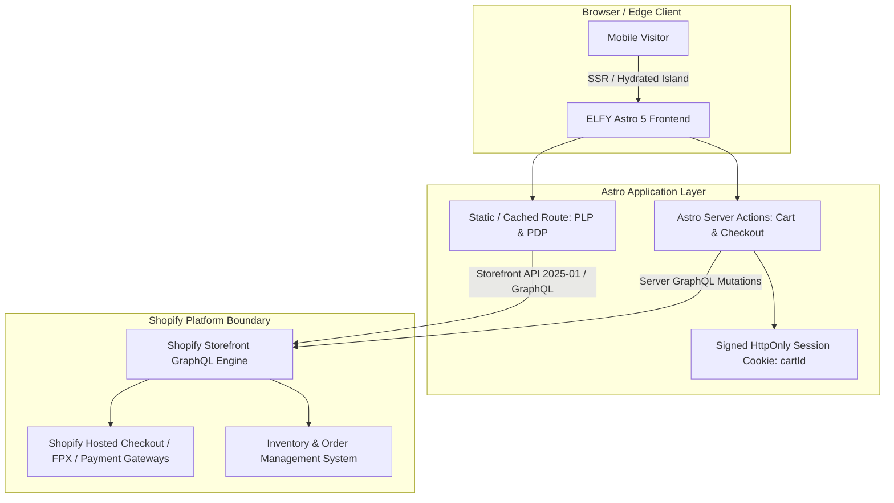

# PRD — ELFY Storefront (Headless Shopify Malaysia: Footwear & Timepieces)

## 1. Executive Summary & Brand Identity

- **Brand Name**: **ELFY** (ELFY Goods / ELFY Kuala Lumpur)
- **Tagline**: *Curated Footwear & Precision Timepieces*
- **Aesthetic**: Minimalist Luxury, Warm Earthy Neutrals (`#121212`, `#FDFBF7`, `#C5A880`, `#E5E0D8`), High Sartorial Craftsmanship.
- **Niche**: Premium Footwear (Dress Shoes, Loafers, Minimal Sneakers) and Curated Watches (Automatic, Quartz, Sapphire Crystal).
- **Target Geography**: Malaysia (`MY`), with dual-language capability (`en-MY` and `ms-MY`).
- **Core Technology Stack**: Astro 5 (Server/Hybrid Islands), TypeScript, Tailwind CSS, Lucide Icons, Shopify Storefront API (GraphQL).
- **Primary Business Objectives**:
  1. Sub-second Page Load (LCP < 1.2s on 4G mobile) to maximize return on ad spend (ROAS) from Meta/TikTok Ads.
  2. High-converting mobile-first UX tailored for Malaysia (Ringgit Malaysia `RM`, FPX/DuitNow/E-Wallet checkout recognition, WhatsApp concierge checkout support).
  3. Reduced sizing & specification return rates via interactive Shoe Size Converters (EU/UK/CM) and Watch Spec Matrices (Case mm, Lug width, Movement, Water Resistance).

---

## 2. Market Localization & Commercial Drivers (Malaysia)

| Dimension | Specification | Implementation Strategy |
| :--- | :--- | :--- |
| **Brand Label** | **ELFY** | Unified storefront branding, packaging callouts, and clean typographic mark. |
| **Currency** | Ringgit Malaysia (`MYR` / `RM`) | Formatted as `RM 249.00` via `Intl.NumberFormat('ms-MY', { style: 'currency', currency: 'MYR' })`. |
| **Languages** | English (`en-MY`) & Bahasa Melayu (`ms-MY`) | Subpath routing (`/en/...` and `/ms/...`) with Shopify `@inContext(language: MS, country: MY)` Storefront API queries. |
| **Payment Ecosystem** | FPX, DuitNow QR, TNG eWallet, GrabPay, SPayLater, Atome | Native Shopify Hosted Checkout handoff with local gateway badges displayed prominently on PDP and Cart Drawer. |
| **Domestic Shipping** | Semenanjung (Peninsular) vs Sabah & Sarawak | Dynamic shipping estimate callout and 5-digit Malaysian Poskod validator. |
| **Customer Support** | WhatsApp-First Commerce | Floating WhatsApp consultation CTA with pre-filled product handle/variant query (`wa.me/601XXXXXXXX?text=...`). |

---

## 3. Architecture & Technical Decision Boundaries

### 3.1 Stack Selection
- **Framework**: Astro 5 (`output: 'server'` with edge or Node adapter) for zero-JS-by-default performance.
- **Islands Architecture**: Minimal client-side JavaScript components for:
  - `CartDrawer` (Slide-over cart state)
  - `VariantPicker` (Real-time stock & price switching)
  - `ShoeSizeGuideModal` (Interactive shoe size & foot length converter)
  - `WatchSpecSheet` (Technical specification sheet)
  - `ProductGallery` (Mobile swipeable gallery with touch pinch-to-zoom)
  - `WhatsAppFloatingButton` (Direct chat link with product context)
- **Styling**: Tailwind CSS with ELFY brand design tokens.
- **Icons**: `lucide-astro` (server-rendered SVGs) and `lucide-react` (for interactive client islands).
- **Type Safety**: Strictly typed Shopify Storefront API GraphQL responses and client schemas via TypeScript.

---

## 4. Feature Requirements (EARS Format)

### 4.1 Product Catalog & Merchandising (Shoes & Watches)
- **REQ-01**: **When** a user visits a shoe PDP, the system **shall** display standard EU sizes alongside UK and CM foot length mappings.
- **REQ-02**: **When** a user views a watch PDP, the system **shall** render a technical specification table (Case Diameter, Lug-to-Lug, Movement Type, Glass/Crystal, Water Resistance).
- **REQ-03**: **When** a product variant is out of stock, the variant button **shall** be visually disabled with a strikethrough and a "Notify via WhatsApp / Email" trigger.
- **REQ-04**: **Where** discounts or promotions exist, the system **shall** display the original crossed-out price, the current price in `RM`, and the percentage badge (e.g., `-20%`).

### 4.2 Cart & Checkout Pipeline
- **REQ-05**: **When** a user clicks "Add to Cart", the system **shall** execute an Astro Server Action against the Shopify Storefront API `cartLinesAdd` mutation and open the Cart Drawer without full-page reload.
- **REQ-06**: **When** a user navigates between pages, the system **shall** preserve the active `cartId` inside an encrypted/signed HttpOnly session cookie.
- **REQ-07**: **When** the user clicks "Checkout", the system **shall** retrieve the fresh `checkoutUrl` from Shopify and immediately redirect the buyer to the secure Shopify Hosted Checkout.
- **REQ-08**: The cart drawer **shall** include a dynamic Free Shipping Progress Bar (e.g., "Add RM 45 more for Free Shipping across Peninsular Malaysia").

### 4.3 Malaysian Localization & Trust Elements
- **REQ-09**: **When** a user switches language between English and Bahasa Melayu, the system **shall** adjust routing and request localized titles/descriptions from Shopify `@inContext`.
- **REQ-10**: The footer and PDP **shall** feature Malaysian payment icons (FPX, DuitNow, Visa/Mastercard, GrabPay, Touch 'n Go eWallet, SPayLater).
- **REQ-11**: Every product page **shall** include a "Beli Terus / Direct WhatsApp Order" alternative link for buyers who prefer direct manual bank transfer / WhatsApp concierge.

---

## 5. Non-Functional Requirements (Performance & Security)

1. **Performance**:
   - Google Lighthouse Mobile Score >= 95.
   - Largest Contentful Paint (LCP) <= 1.2s.
   - Cumulative Layout Shift (CLS) <= 0.02.
   - First Input Delay (FID) / INP <= 100ms.
2. **Security**:
   - Private Storefront access tokens and Admin API keys (if any) **must never** be exposed to the browser.
   - Public Storefront API token used strictly within safe scopes.
   - Strict Content Security Policy (CSP) and CORS boundaries.
3. **SEO & Metadata**:
   - Automated OpenGraph (`og:image`, `og:title`) and Twitter Cards.
   - JSON-LD Structured Data for `Product`, `BreadcrumbList`, and `Organization` (ELFY).
   - Dynamic `sitemap-index.xml` and localized `hreflang` tags (`en-MY`, `ms-MY`).
